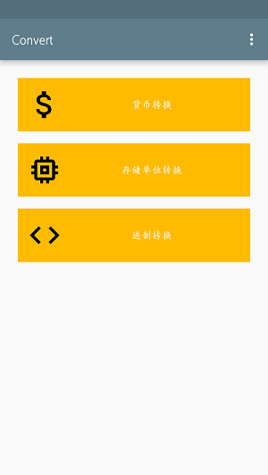
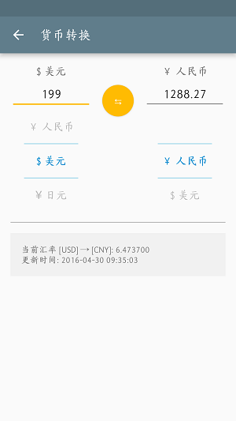

# convert
具有转化功能的工具（货币，存储单位，进制......）

---

## 功能介绍

- 货币转换  
- 存储空间转换  
- 进制转换  
- ...

## 项目中使用到  

- [Android滚动选择控件](https://github.com/wangjiegulu/WheelView)
- [Material icons](https://design.google.com/icons/)

## 杂

- Android Studio 2.0
- minSdkVersion 15
- targetSdkVersion 23
- sealiu - 2016/4

## 预览

